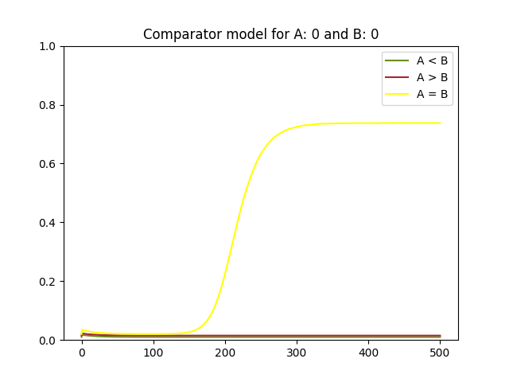
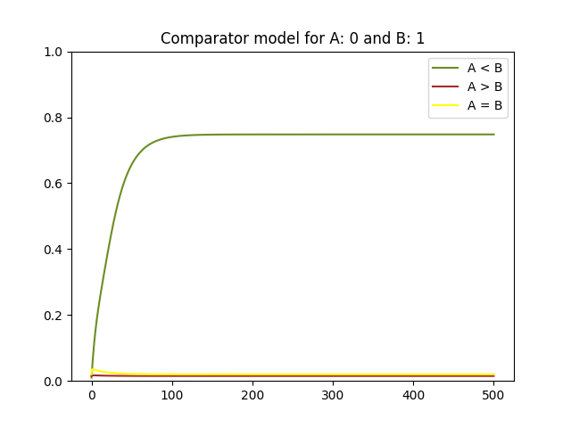
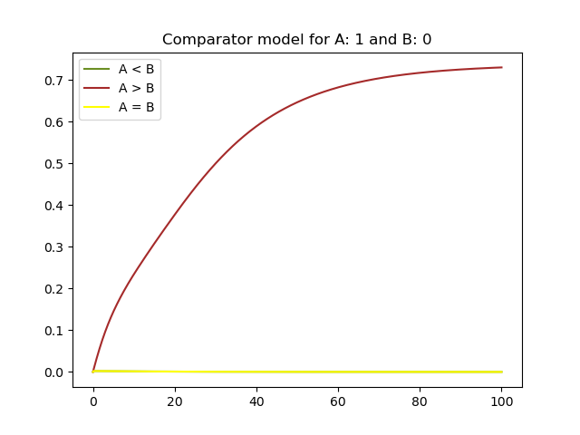
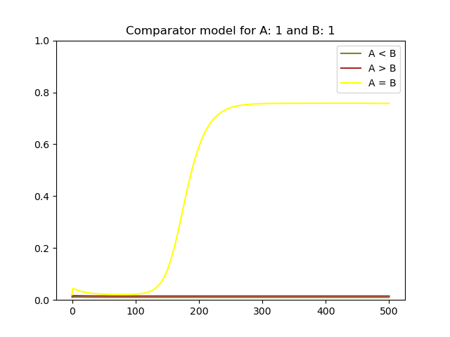

## 1-bit magnitude comparator implementation using biological logic blocks

### Building the model

Osnovna implementacija 1-bitnega primerjalnika v digitalnih vezjih:

Biološki gradniki podpirajo le vrata OR in NOT, zato potrebujemo vezje pretvoriti tako, da bo uporabljalo le te gradnike.

Predelano vezje:

V modelu **comparator_model** (_1\_bit\_comparator.ipynb_) shranjujemo rezultate po naslednji shemi:

### Testing the model

