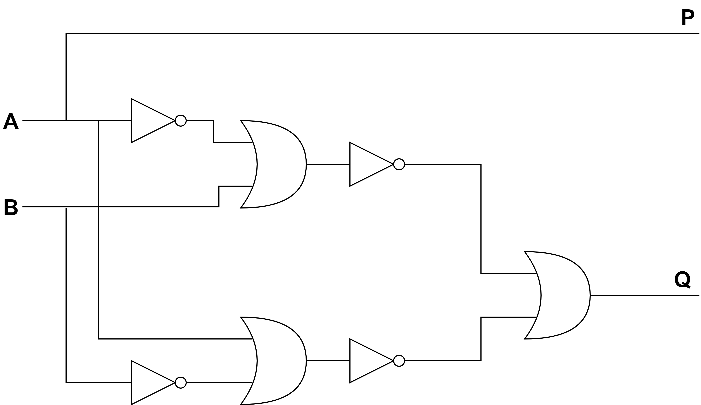

## 1-bit magnitude comparator implementation using biological logic blocks

### Building the model

Osnovna implementacija 1-bitnega primerjalnika reda velikosti v digitalnih vezjih:

Biološki gradniki podpirajo le vrata OR in NOT, zato potrebujemo vezje pretvoriti tako, da bo uporabljalo le te gradnike.

Predelano vezje:

V modelu **comparator_model** (_1\_bit\_magnitude\_comparator.ipynb_) shranjujemo rezultate po naslednji shemi:

### Testing the model

## 1-bit identity comparator implementation using biological logic blocks

### Building the model

Osnovna implementacija 1-bitnega primerjalnika enakosti v digitalnih vezjih:

Biološki gradniki podpirajo le vrata OR in NOT, zato potrebujemo vezje pretvoriti tako, da bo uporabljalo le te gradnike.

Predelano vezje:

V modelu **comparator_model** (_1\_bit\_identity\_comparator.ipynb_) shranjujemo rezultate po naslednji shemi:

### Testing the model

## 2-bit identity comparator implementation using biological logic blocks

### Building the model

Osnovna implementacija 2-bitnega primerjalnika enakosti v digitalnih vezjih:

Biološki gradniki podpirajo le vrata OR in NOT, zato potrebujemo vezje pretvoriti tako, da bo uporabljalo le te gradnike.

Predelano vezje:

V modelu **comparator_model** (_2\_bit\_identity\_comparator.ipynb_) shranjujemo rezultate po naslednji shemi:

### Testing the model

## 1-bit reversible feynman gate implementation using biological logic blocks

### Building the model

Osnovna implementacija 1-bitnih reverzibilnih Feynman vrat v digitalnih vezjih:

Biološki gradniki podpirajo le vrata OR in NOT, zato potrebujemo vezje pretvoriti tako, da bo uporabljalo le te gradnike.

Predelano vezje:

V modelu **reversible_feynman_gate** (_1\_bit\_reversible\_feynman\_gate.ipynb_) shranjujemo rezultate po naslednji shemi:

### Testing the model

